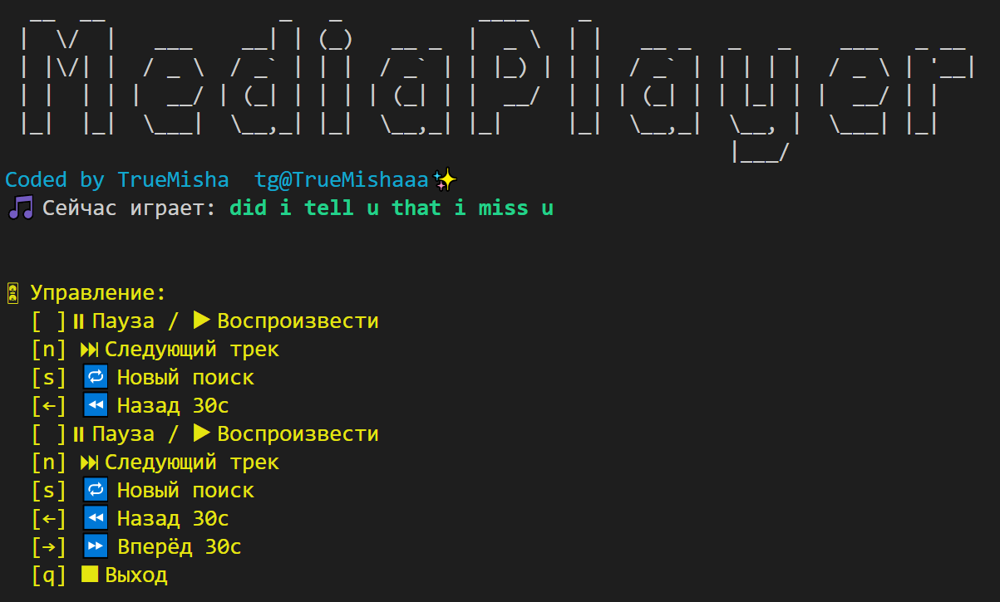

# 🎧 MediaPlayer (SoundCloud Terminal Player)

**MediaPlayer** — это терминальный медиаплеер на Go с возможностью поиска и воспроизведения треков из **SoundCloud**.  
Поддерживает управление с клавиатуры: пауза, перемотка, переключение трека, а также динамический поиск. Работает в **Linux**, **macOS** и **Windows**.

---

## 📚 Содержание

- [🛠 Возможности](#-возможности)
- [📦 Установка (Windows / Linux / macOS)](#-установка-windows--linux--macos)
- [🔐 Переменная окружения: SoundCloud Client ID](#-переменная-окружения-soundcloud-client-id)
- [🗂 Структура проекта](#-структура-проекта)
- [⌨ Управление в плеере](#-управление-в-плеере)
- [📚 Используемые библиотеки](#-используемые-библиотеки)
- [📬 Обратная связь](#-обратная-связь)

---

## 🛠 Возможности

- 🔍 Поиск треков по ключевым словам
- 🎶 Потоковое воспроизведение MP3 (с буферизацией)
- ⏯ Пауза, перемотка, переключение треков
- 🖥 Красочный терминальный UI (`go-figure`, `color`)
- ⌨ Полноценное управление с клавиатуры
- 💬 Возможность динамического нового поиска в любой момент

---

## 📦 Установка (Windows / Linux / macOS)

> Требуется: **Go 1.18+**, установленный `ffmpeg`

### 🔷 Windows

Скачайте установщик Go с официального сайта: https://go.dev/dl/

- Запустите установщик и следуйте инструкциям
- Проверьте установку командой в терминале:
  ```bash
  go version
  ```

```bash
git clone https://github.com/TrueMisha/mediaplayer.git
cd mediaplayer
go run main.go
```

---

### 🟩 Linux

```bash
sudo apt update
sudo apt install golang-go ffmpeg git -y

git clone https://github.com/TrueMisha/mediaplayer.git
cd mediaplayer

go mod tidy
go build -o mediaplayer

# Сделать глобальной командой:
sudo mv mediaplayer /usr/local/bin/scplayer
```

Теперь можешь запускать:

```bash
scplayer
```

---

### 🍎 macOS

```bash
brew install go ffmpeg git

git clone https://github.com/TrueMisha/mediaplayer.git
cd mediaplayer

go mod tidy
go build -o mediaplayer

sudo mv mediaplayer /usr/local/bin/scplayer
```

Запуск:

```bash
scplayer
```

> 💡 Если `/usr/local/bin` не в `$PATH`, можно использовать `~/go/bin` или настроить свою директорию.

---

## 🔐 Переменная окружения: SoundCloud Client ID

Для работы медиаплеера требуется `Client ID` от SoundCloud:

1. Получи его на [https://developers.soundcloud.com](https://developers.soundcloud.com)
2. Установи переменную окружения:

### Linux/macOS:

```bash
export SOUNDCLOUD_CLIENT_ID=your_client_id
```

(добавь в `~/.bashrc` или `~/.zshrc` для постоянства)

### Windows (PowerShell):

```powershell
создать `.env` файл в корне проекта:
  env
SOUNDCLOUD_CLIENT_ID=your_client_id

```

---

## 🗂 Структура проекта

```bash
📁 mediaplayer/
├── 📁 player/
│   └── player.go          # Логика воспроизведения треков
├── 📁 soundcloud/
│   └── soundcloud.go      # Работа с SoundCloud API
├── 📁 ui/
│   └── ui.go              # Отображение интерфейса в консоли (меню, вывод)
├── 📁 utils/
│   └── utils.go           # Вспомогательные функции (логирование, конвертация и пр.)
├── .env                   # Переменные окружения (например, ключи API)
├── .gitignore             # Исключения для git
├── go.mod                 # Манифест модуля Go
├── go.sum                 # Контрольные суммы зависимостей
└── main.go                # Точка входа, инициализация приложения
```

---

## ⌨ Управление в плеере

| Клавиша         | Действие                   |
| --------------- | -------------------------- |
| `p` или `Space` | ⏸ Пауза / ▶ Воспроизвести  |
| `n`             | ⏭ Следующий трек           |
| `s`             | 🔁 Новый поиск             |
| `←`             | ⏪ Перемотка назад 30 сек  |
| `→`             | ⏩ Перемотка вперёд 30 сек |
| `q`             | ⏹ Выход из плеера          |

---

## 🖼 Пример интерфейса

---

## 

## 📚 Используемые библиотеки

- [`beep`](https://github.com/faiface/beep) — воспроизведение аудио
- [`eiannone/keyboard`](https://github.com/eiannone/keyboard) — захват клавиш
- [`fatih/color`](https://github.com/fatih/color) — цветной текст в терминале
- [`go-figure`](https://github.com/common-nighthawk/go-figure) — ASCII-арт
- `net/http`, `os`, `bufio`, `log`, `encoding/json` — стандартные библиотеки Go

---

## ✅ TODO

- [ ] Сделать TUI-интерфейс плеера (более интерактивный и удобный)
- [ ] Оптимизировать загрузку треков для ускоренного старта воспроизведения
